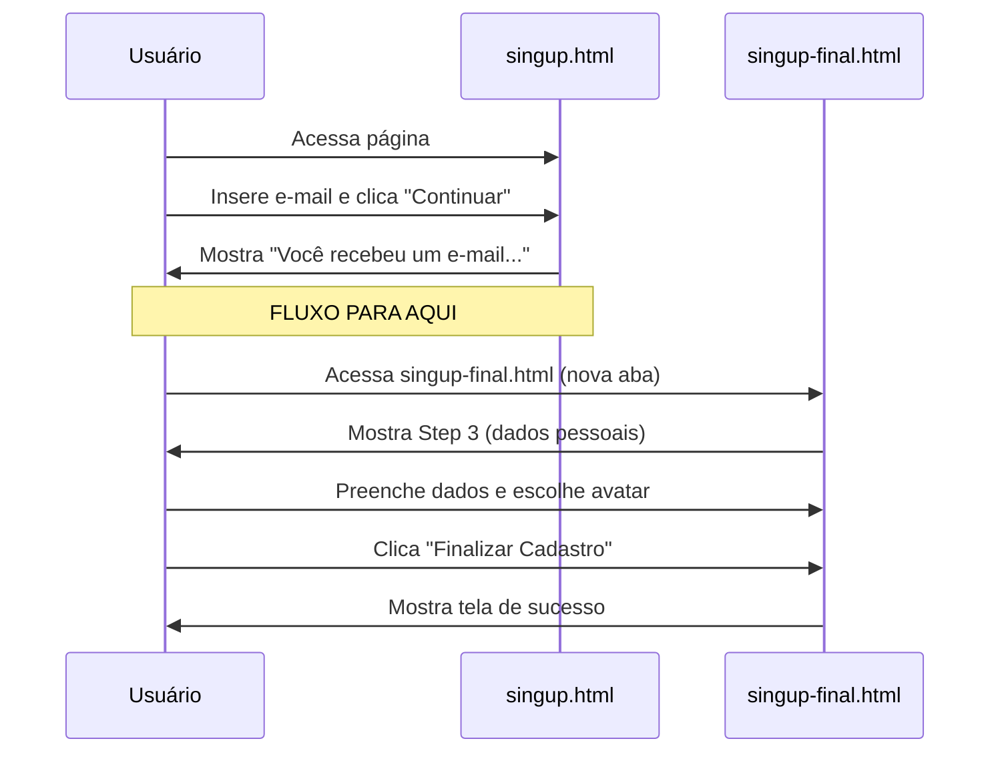
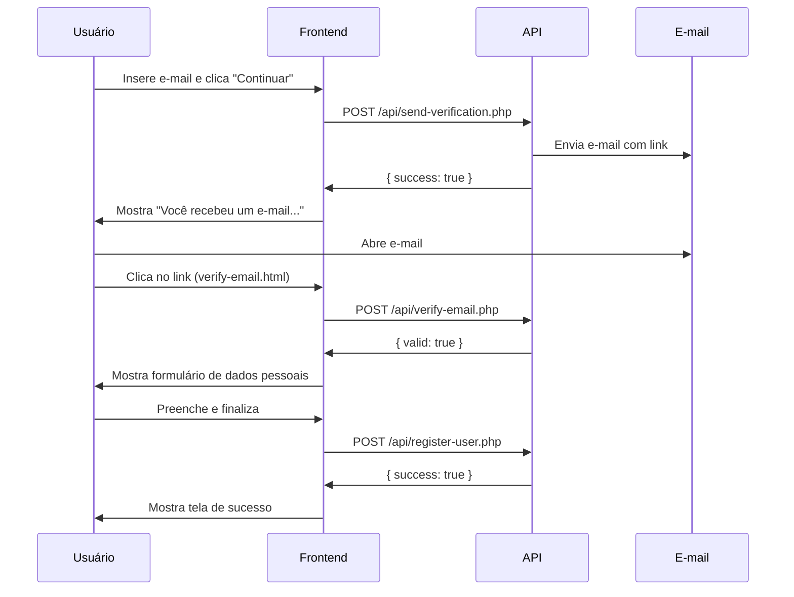

# Sistema de Verificação por E-mail - VIDDIA

## ⚠️ IMPORTANTE: Páginas Ilustrativas

**As páginas HTML são apenas PROTÓTIPOS/MOCKUPS ilustrativos e não possuem integração real com API.**

## Visão Geral do Fluxo Ilustrado

Este protótipo demonstra um fluxo de verificação de e-mail por link ao invés de código numérico:

1. Usuário insere e-mail corporativo ([singup.html](../html/html/singup.html))
2. **PARA AQUI** - Exibe mensagem "Você recebeu um e-mail, clique no link para continuar"
3. Usuário visualiza [singup-final.html](../html/html/singup-final.html) que simula o estado após clicar no link
4. Usuário completa perfil (nome, data de nascimento, avatar)

## Arquivos do Protótipo

### Páginas HTML (Apenas Ilustrativas)

- **[singup.html](../html/html/singup.html)** - Página inicial de cadastro
  - Coleta e-mail corporativo
  - Exibe mensagem de "E-mail enviado"
  - **Fluxo termina aqui** (não avança para próximos passos)

- **[singup-final.html](../html/html/singup-final.html)** - Continuação do fluxo
  - **Inicia direto no Step 3** (dados pessoais)
  - Simula que o usuário já verificou o e-mail
  - Coleta: nome, data de nascimento, avatar
  - Exibe tela de sucesso ao final

- **[verify-email.html](../html/html/verify-email.html)** - Página de verificação (referência)
  - Ilustra como seria a página de validação do link
  - **Não é utilizada no fluxo atual** (apenas para referência)

### Backend (API)

- **send-verification.php** - Envia e-mail de verificação
- **verify-email.php** - Valida token de verificação
- **resend-verification.php** - Reenvia e-mail de verificação
- **database-schema.sql** - Schema do banco de dados

## Como Visualizar o Protótipo

### Fluxo de Navegação

1. **Abra [singup.html](../html/html/singup.html)**
   - Digite qualquer e-mail no formato válido
   - Clique em "Continuar"
   - Verá a mensagem de e-mail enviado
   - **O fluxo para aqui**

2. **Abra [singup-final.html](../html/html/singup-final.html)** em outra aba
   - Já inicia na tela de dados pessoais (Step 3)
   - Preencha: nome, data de nascimento
   - Escolha um avatar ou faça upload de foto
   - Clique em "Finalizar Cadastro"
   - Verá a tela de sucesso

---

## Arquivos Backend (Para Implementação Futura)

Os arquivos PHP abaixo são modelos/templates para quando você quiser implementar o backend real:

### 1. Banco de Dados (Para Implementação Futura)

Execute o arquivo `database-schema.sql` quando for implementar:

```bash
mysql -u seu_usuario -p sua_database < api/database-schema.sql
```

### 2. Configuração do Banco de Dados (Para Implementação Futura)

Edite os arquivos PHP em `/api` para adicionar suas credenciais:

```php
$db = new PDO('mysql:host=localhost;dbname=viddia', 'username', 'password');
```

### 3. Configuração de E-mail (Para Implementação Futura)

**Importante:** O PHP `mail()` pode não funcionar em todos os ambientes. Para produção, é recomendado usar um serviço de e-mail como:

- **SendGrid**
- **Mailgun**
- **Amazon SES**
- **Postmark**

Exemplo usando SendGrid (substitua no lugar do `mail()` nos arquivos PHP):

```php
// Install: composer require sendgrid/sendgrid
require 'vendor/autoload.php';

$from = new SendGrid\Mail\From("noreply@viddia.com", "VIDDIA");
$to = new SendGrid\Mail\To($email);
$subject = new SendGrid\Mail\Subject("VIDDIA - Verifique seu e-mail");
$content = new SendGrid\Mail\HtmlContent($message);

$mail = new SendGrid\Mail\Mail($from, $to, $subject, null, $content);

$sendgrid = new \SendGrid('YOUR_SENDGRID_API_KEY');
$response = $sendgrid->send($mail);
```

### 4. Configuração do Servidor Web

Certifique-se de que o servidor PHP está configurado e rodando:

```bash
# Para desenvolvimento local
php -S localhost:8000
```

Ou configure o Apache/Nginx para servir os arquivos.

## Estrutura do Banco de Dados

### Tabela: verification_tokens

| Campo      | Tipo         | Descrição                                    |
|------------|--------------|----------------------------------------------|
| id         | INT          | ID único (auto-incremento)                   |
| email      | VARCHAR(255) | E-mail do usuário                            |
| token      | VARCHAR(64)  | Token de verificação (único)                 |
| expires_at | DATETIME     | Data/hora de expiração (24 horas)            |
| created_at | DATETIME     | Data/hora de criação                         |
| used_at    | DATETIME     | Data/hora de uso (NULL se não usado)         |

### Tabela: users

| Campo              | Tipo         | Descrição                                    |
|--------------------|--------------|----------------------------------------------|
| id                 | INT          | ID único (auto-incremento)                   |
| email              | VARCHAR(255) | E-mail do usuário (único)                    |
| full_name          | VARCHAR(255) | Nome completo                                |
| date_of_birth      | DATE         | Data de nascimento                           |
| avatar_id          | INT          | ID do avatar selecionado                     |
| custom_photo       | LONGTEXT     | Foto personalizada (base64)                  |
| email_verified_at  | DATETIME     | Data/hora de verificação do e-mail           |
| created_at         | DATETIME     | Data/hora de criação                         |
| updated_at         | DATETIME     | Data/hora da última atualização              |

## Endpoints da API

### POST /api/send-verification.php

Envia e-mail de verificação.

**Request:**
```json
{
  "email": "usuario@empresa.com"
}
```

**Response (Success):**
```json
{
  "success": true,
  "message": "Verification email sent successfully",
  "email": "usuario@empresa.com"
}
```

**Response (Error):**
```json
{
  "error": "Invalid email format"
}
```

### POST /api/verify-email.php

Valida token de verificação.

**Request:**
```json
{
  "token": "abc123...",
  "email": "usuario@empresa.com"
}
```

**Response (Success):**
```json
{
  "success": true,
  "valid": true,
  "message": "Email verified successfully",
  "email": "usuario@empresa.com"
}
```

**Response (Error):**
```json
{
  "error": "Invalid or expired token",
  "valid": false
}
```

### POST /api/resend-verification.php

Reenvia e-mail de verificação.

**Request:**
```json
{
  "email": "usuario@empresa.com"
}
```

**Response (Success):**
```json
{
  "success": true,
  "message": "Verification email resent successfully",
  "email": "usuario@empresa.com"
}
```

## Fluxo Ilustrativo (Protótipo)



## Fluxo Real (Para Implementação Futura)



## Segurança

### Tokens de Verificação

- Tokens são gerados usando `random_bytes(32)` (64 caracteres hexadecimais)
- Tokens expiram em 24 horas
- Tokens só podem ser usados uma vez
- Tokens inválidos ou expirados retornam erro

### Rate Limiting

O arquivo `resend-verification.php` inclui comentários sobre implementação de rate limiting para prevenir spam. Descomentar e configurar conforme necessário.

### Validação de E-mail

- E-mails são validados tanto no frontend quanto no backend
- Filtros PHP são usados para sanitização

## Limpeza de Dados

Para remover tokens expirados ou usados, execute periodicamente:

```sql
DELETE FROM verification_tokens
WHERE expires_at < NOW()
   OR (used_at IS NOT NULL AND used_at < DATE_SUB(NOW(), INTERVAL 7 DAY));
```

Configure como cron job:

```bash
# Executar diariamente às 3:00 AM
0 3 * * * mysql -u username -ppassword database < cleanup-tokens.sql
```

## Status Atual vs Implementação Futura

### ✅ Status Atual (Protótipo HTML)

- Páginas HTML ilustrativas funcionando
- Fluxo visual completo demonstrado
- **Sem integração com backend**
- **Sem envio real de e-mails**
- **Sem validação de tokens**

### 🚧 Para Implementação Futura (Backend Real)

Quando implementar o backend, você precisará:

1. Descomentar todas as seções `TODO:` nos arquivos PHP
2. Configurar credenciais do banco de dados
3. Configurar serviço de e-mail (SendGrid, Mailgun, etc.)
4. Implementar rate limiting
5. Adicionar logs apropriados
6. Configurar HTTPS
7. Implementar CSRF protection

## Troubleshooting

### E-mails não estão sendo enviados

1. Verifique a configuração do servidor PHP para `mail()`
2. Considere usar um serviço de e-mail externo
3. Verifique os logs do servidor: `tail -f /var/log/mail.log`

### Tokens sempre inválidos

1. Verifique se o banco de dados está configurado corretamente
2. Verifique se as seções de banco de dados estão descomentadas
3. Verifique os logs: `error_log()` está logando no console

### Redirecionamento não funciona

1. Verifique se o sessionStorage está habilitado no navegador
2. Verifique se os parâmetros da URL estão corretos
3. Verifique o console do navegador para erros JavaScript

## Próximos Passos para Implementação Real

Quando estiver pronto para implementar o backend:

- [ ] Conectar [singup.html](../html/html/singup.html) com `/api/send-verification.php`
- [ ] Configurar banco de dados com `database-schema.sql`
- [ ] Integrar serviço de e-mail (SendGrid/Mailgun)
- [ ] Configurar [verify-email.html](../html/html/verify-email.html) para validar tokens reais
- [ ] Substituir [singup-final.html](../html/html/singup-final.html) por redirecionamento do link
- [ ] Implementar rate limiting
- [ ] Adicionar testes automatizados
- [ ] Configurar monitoramento de e-mails
- [ ] Adicionar analytics de taxa de verificação

---

## 📌 Resumo

**Este é um PROTÓTIPO visual sem backend.**

- **singup.html** = Tela 1 (coleta e-mail, mostra mensagem)
- **singup-final.html** = Tela 2 (formulário de dados pessoais)
- **Arquivos `/api/*.php`** = Templates para implementação futura
- **verify-email.html** = Referência de como seria a validação

Para ver o fluxo completo, navegue manualmente entre as duas páginas HTML.
